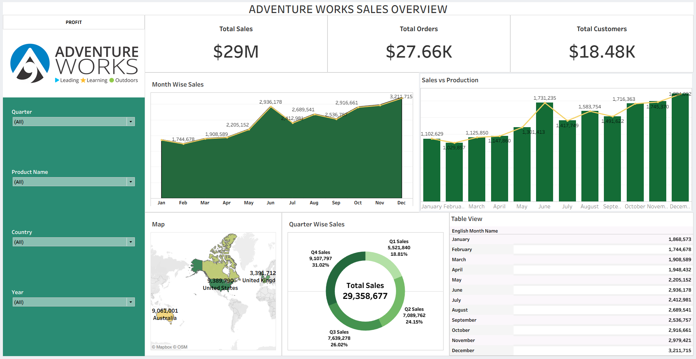
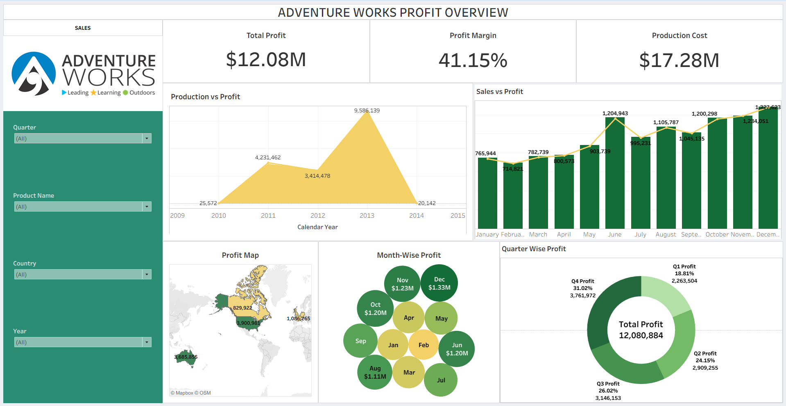

# Adventure-works-analytics-dashboard
Sales and profit analysis of the Adventure Works dataset using SQL and Power BI with interactive dashboards and business insights.

# 📌 Project Overview
 An end-to-end data analytics project using the Adventure Works dataset.
 Performed data cleaning, transformation, analysis, and visualization.
 Tools used: Excel, Power BI, Tableau, MySQL (SQL).
 Focused on analyzing Sales, Profit, Production Cost, Total Orders, and Fright charges.

## 🧰 Tools & Technologies
- **SQL (MySQL)** → Query-based analysis & Data Validation.
- **Power BI** → Data Modeling & Interactive Dashboards.
- **Excel** → Data Cleaning & Preprocessing.
- **Tableau** → Advanced Visual Analytics & Storytelling.
- **PowerPoint** → Business presentation

## 📂 Dataset Description
The dataset follows a **star schema**:
- **Fact Table**: Sales
- **Dimension Tables**: Customer, Product, Date, Territory

## 📊 Dashboards & Analysis
### Sales Dashboard
- Total Sales, Quantity Sold
- Year-wise and Month-wise trends
- Regional sales comparison

### Profit Dashboard
- Total Profit & Profit Margin
- Product-wise profitability
- Year-over-Year performance

## 🖥️ KPI's Used
- **Total Sales** 
- **Total Profit** 
- **Total Production cost** 
- **Total Fright charges** 
- **Total orders**

## 🧠 Key Insights
- Identified top-performing products and regions.
- Analyzed seasonal trends impacting sales and profit.
- Highlighted top performing countries.
- Products delivered category-wise and sub-category-wise, indicating sales and profit.

## 📊 Dashboard Preview

### Sales Dashboard

### Profit Dashboard

